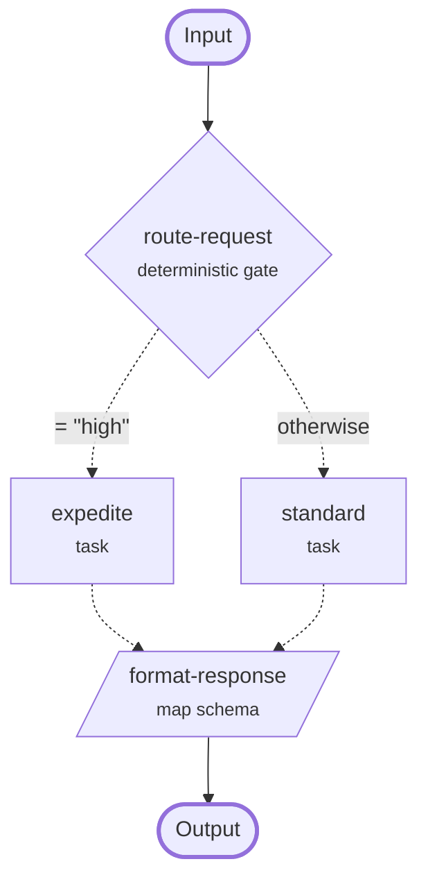

# Camau


(`camau` - *Welsh*, 'cam-eye', meaning 'steps')

Camau is a Rust-backed asynchronous JSON workflow router for Python. the tool makes use of a generic vocabulary of tasks to manage routing for JSON messages between APIs - particularly useful for gateway services in machine learning usecases. `Camau` makes use of json configuration files for its routing rules, to allow for human readable and machine enforcible boundaries.

## Setup

to use `camau` you must first install it, ideally into a python virtual environment:

```
pip install uv

uv venv --python 3.13
source .venv/bin/activate # or .venv\Scripts\activate on windows

uv pip install camau
```

from here, `camau` exposes 4 tools:

1. python based `Router` object (for use in APIs)
2. cmd schema analysis tool (for use in CI/CD)
3. cmd based routing visualisation tool (for use in user documentation)
4. agent skill for writing new configurations

The examples below all use the same three-layer workflow. It sends high-priority
requests to one task and all other requests to another, then reduces the task result
to a small response object. Save it as `routing.json` to follow the examples.

```json
{
  "entry": "route-request",
  "output": "format-response",
  "nodes": [
    {
      "id": "route-request",
      "type": "deterministic-gate",
      "select": "/priority",
      "cases": [
        {"operator": "eq", "value": "high", "target": "expedite"},
        {"operator": "otherwise", "target": "standard"}
      ]
    },
    {
      "id": "expedite",
      "type": "task",
      "task": "priority-handler",
      "next": "format-response"
    },
    {
      "id": "standard",
      "type": "task",
      "task": "standard-handler",
      "next": "format-response"
    },
    {
      "id": "format-response",
      "type": "map-schema",
      "mappings": [
        {
          "target": "/request-id",
          "path-to-source": "/request/id",
          "type": "string"
        },
        {
          "target": "/handled-by",
          "path-to-source": "/handled-by",
          "type": "string"
        }
      ]
    }
  ]
}
```

### Router

`Router` is the Python interface. Import and use a `Router` object into your python session to consume a configuration json and route input messages as described.

#### Example

```python
import asyncio
from pathlib import Path

from camau import Router


async def priority_handler(request):
    return {**request, "handled-by": "priority"}


async def standard_handler(request):
    return {**request, "handled-by": "standard"}


router = Router(
    Path("routing.json").read_text(encoding="utf-8"),
    {
        "priority-handler": priority_handler,
        "standard-handler": standard_handler,
    },
)


async def main():
    result = await router.run({"request": {"id": "req-42"}, "priority": "high"})
    print(result)


asyncio.run(main())
```

```text
{'request-id': 'req-42', 'handled-by': 'priority'}
```

The full Python interface, including exceptions and task result requirements, is
defined in [the Python API specification](spec/PYTHON-API.md).

### Analysis

`camau assess` checks a routing specification json **without** running any tasks. It reports
JSON structure errors and workflow problems such as missing references, unreachable
nodes, cycles, invalid gate cases, and incorrect convergence. A valid assessment exits
with status `0`; invalid input exits with status `1`. Text, JUnit XML, and GitHub
annotation output are available for local use and CI.

`camau schema` prints the `camau` configuration JSON Schema when an editor or another tool needs
the structural schema directly.

#### Example

```console
$ camau assess routing.json
Camau assessment valid
```

For CI, select a machine-readable report with `--format junit` or `--format github`.

### Visualiser

`camau diagram` turns a valid routing specification into a Markdown document containing
a Mermaid workflow graph, a routing legend, and a table describing each node. It runs
the same assessment first and does not emit a partial diagram for an invalid workflow.

#### Example

```console
$ camau diagram routing.json > routing.md
```



The generated `routing.md` shows the `route-request` gate leading to either task, with
both routes continuing to `format-response`.

### Skill

The repository includes a `camau-routing` skill for coding agents. It supplies the
configuration rules and a verification sequence for creating, changing, or reviewing
a routing specification.

#### Example

Give the agent the task contracts and intended behaviour rather than asking it to infer
either from task names:

```text
Use the Camau routing skill to create routing.json. Requests have a string at
/request/id and a string at /priority. Route "high" priority to the asynchronous
priority-handler task and every other value to the asynchronous standard-handler
task. Both tasks accept the request object and return it with a string at /handled-by.
Return only /request-id and /handled-by. Assess the specification, inspect its diagram,
bind both tasks to construct Router, and exercise the high-priority and fallback routes.
```

The resulting specification is the same `routing.json` used by the Router, analysis,
and visualisation examples above.

## AI use disclosure

`camau` was built using an agentic ai harness, you can read about the process and my takeaways on [this blog](). future updates to the tool where appropriate will make less use of ai now that the initial experiment is complete.
