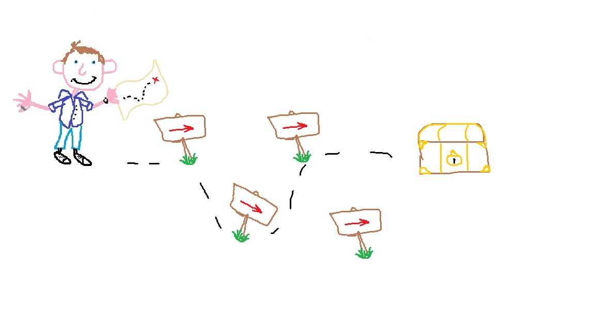

# Camau


(`camau` - *Welsh*, 'cam-eye', meaning 'steps')

Camau is a Rust-backed asynchronous JSON workflow router for Python. the tool makes use of a generic vocabulary of tasks to manage routing for JSON messages between APIs - particularly useful for gateway services in machine learning usecases. `Camau` makes use of json configuration files for its routing rules, to allow for human readable and machine enforcible boundaries.

## Setup

to use `camau` you must first install it, ideally into a python virtual environment:

```
pip install uv

uv venv --python 3.13
source .venv/bin/activate # or .venv\Scripts\activate on windows

uv pip install camau
```

from here, `camau` exposes 4 tools:

1. python based `Router` object (for use in APIs)
2. cmd schema analysis tool (for use in CI/CD)
3. cmd based routing visualisation tool (for use in user documentation)
4. agent skill for writing new configurations

### Router

### Analysis

### Visualiser

### Skill