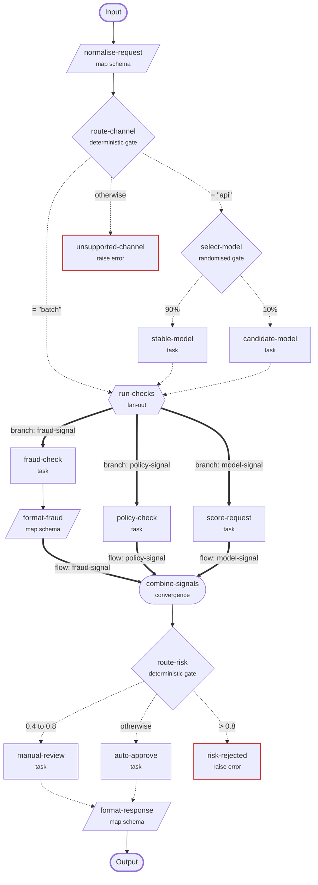

# Camau workflow graph

## How to read this graph

- Routing starts at <code>normalise-request</code> and succeeds at <code>format-response</code>.
- Dotted arrows are mutually exclusive: exactly one route is active. Thick arrows belong to concurrently active branches. Solid arrows are sequential continuation.
- Diamond nodes select one route. Hexagonal fan-out nodes start every branch concurrently. Rounded convergence nodes wait for every labelled input.
- A red failure node stops the run with `GWALL`; it does not lead to the successful output.

## Node details

| Node | Behaviour |
|---|---|
| <code>normalise-request</code> | Builds a new object: <code>/request-id</code> &larr; <code>/request/id</code> (string); <code>/channel</code> &larr; <code>/request/channel</code> (string); <code>/customer</code> &larr; <code>/customer</code> (object). |
| <code>route-channel</code> | Reads <code>/channel</code> and follows the first matching labelled route. |
| <code>select-model</code> | Chooses one labelled route using the normalised weights. |
| <code>stable-model</code> | Calls task <code>stable-predictor</code>. |
| <code>candidate-model</code> | Calls task <code>candidate-predictor</code>. |
| <code>run-checks</code> | Starts all 3 labelled flow branches concurrently. |
| <code>fraud-check</code> | Calls task <code>fraud-checker</code>. |
| <code>format-fraud</code> | Builds a new object: <code>/risk</code> &larr; <code>/risk-score</code> (number); <code>/provider</code> &larr; default <code>"fraud-service"</code> (string). |
| <code>policy-check</code> | Calls task <code>policy-checker</code>. |
| <code>score-request</code> | Calls task <code>risk-scorer</code>. |
| <code>combine-signals</code> | Waits for <code>fraud-signal</code> from <code>format-fraud</code>, <code>policy-signal</code> from <code>policy-check</code>, <code>model-signal</code> from <code>score-request</code> and creates an object keyed by those flow IDs. |
| <code>route-risk</code> | Reads <code>/fraud-signal/risk</code> and follows the first matching labelled route. |
| <code>manual-review</code> | Calls task <code>review-queue</code>. |
| <code>auto-approve</code> | Calls task <code>approval-service</code>. |
| <code>format-response</code> | Builds a new object: <code>/request-id</code> &larr; <code>/request-id</code> (string); <code>/decision</code> &larr; <code>/decision</code> (string); <code>/reviewed</code> &larr; <code>/reviewed</code> or default <code>false</code> (boolean). |
| <code>unsupported-channel</code> | Stops routing with `GWALL`: The request channel is not supported. |
| <code>risk-rejected</code> | Stops routing with `GWALL`: The fraud risk exceeds the gateway threshold. |
